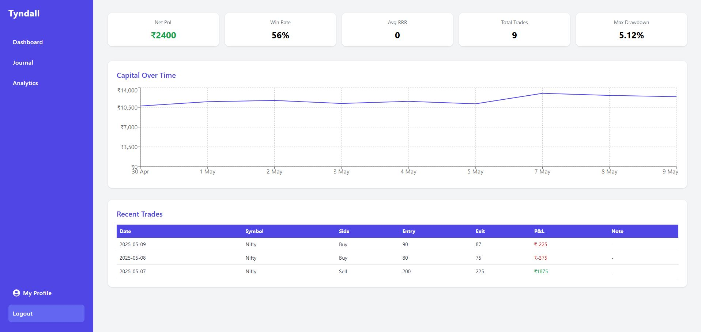
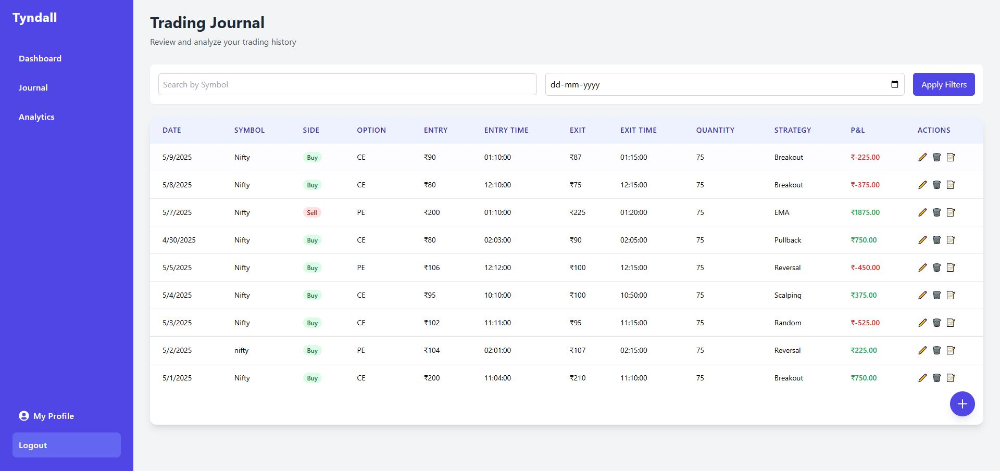
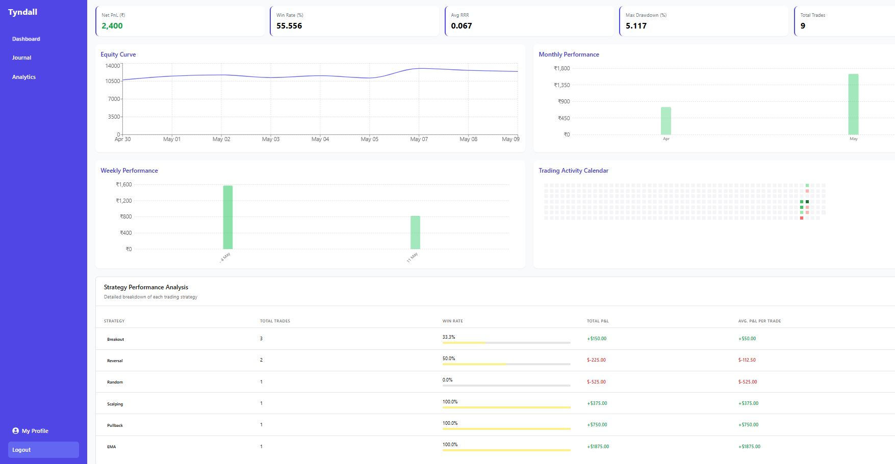

# 🚀 Tyndall – Advanced Trading Analytics Platform

**Tyndall** is a full-stack SaaS product designed for serious intraday traders. It provides actionable insights through detailed journaling, performance dashboards, and strategy-level analytics—so you can trade like a pro, not in the dark.

---

## 🧩 Key Features

✅ JWT-secured authentication with OTP mechanism for user verification  
✅ Trade journal with filters, notes, and export-ready view  
✅ Equity curve, win/loss streaks, monthly & weekly charts  
✅ Strategy-wise performance metrics  
✅ Sleek and fast UI using TailwindCSS & JavaScript  
✅ Built as a production-grade backend using Spring Boot

---

## 💻 Tech Stack

| Layer        | Stack                              |
| ------------ | ---------------------------------- |
| Frontend     | React, JavaScript, TailwindCSS     |
| Backend      | Spring Boot (Java), JWT Auth       |
| Database     | MySQL                              |
| Charts       | Recharts                           |

---

## 📸 Product Screenshots

### Login View

### Dashboard View

### Journal Page

### Analytics Module

---

## 🤝 For Traders, Built By Traders

Tyndall is built to replace spreadsheets and guesswork with structured insights.  
It's more than a product—it's a tool built out of real trading pain.

---

## 📬 Contact

Made by **Shiv Rane**  
📧 shiwrane@gmail.com  
🌐 [Product Page](https://trading-saas-six.vercel.app/)

---

## 📄 License

This project is licensed under the [Creative Commons Attribution-NonCommercial 4.0 International License](https://creativecommons.org/licenses/by-nc/4.0/).
